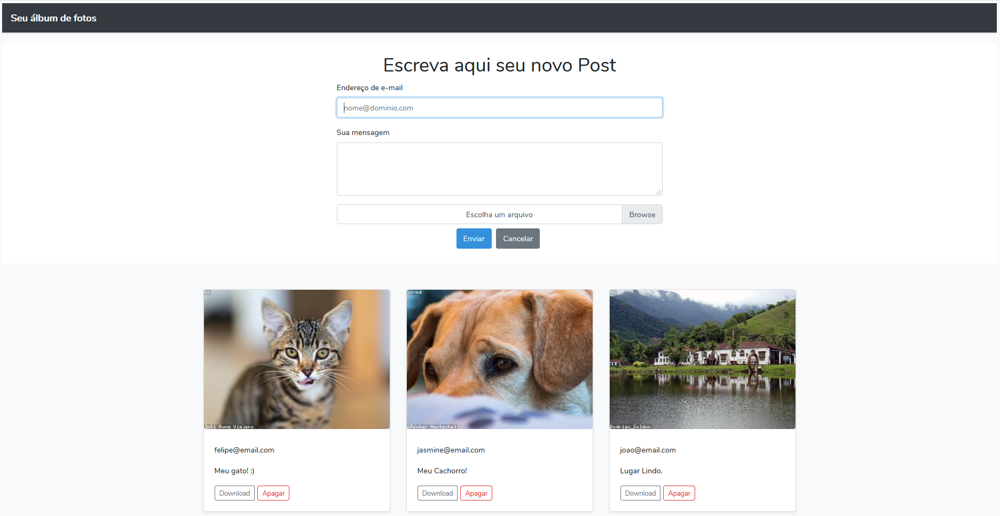

#Laravel - Upload Image

## Sobre

O **Laravel - Upload Image** consiste em um albúm de imagens onde cada usuário pode compartilha suas imagens com os demais usuários.
Este é um projeto puramente didático, que tem por objetivo ensinar como criar um CRUD no laravel e também como trabalhar com upload de arquivos.

## Mais informações
Envie um email para [felipeoliveirasimoes@hotmail.com](felipeoliveirasimoes@hotmail.com)